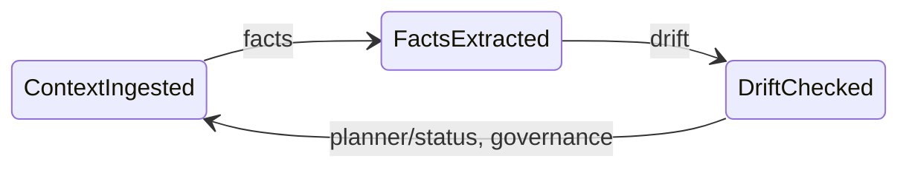

# Swarm of Governed Agents

> Can we replace orchestration-as-topology with governance-as-policy for agent coordination -- with formal convergence guarantees, bitemporal auditability, and a perpetual compliance lifecycle?

Governed agent swarm: event-driven reasoning roles sharing a bitemporal context graph, governed by a Rust reduction kernel (sgrs-core) with formal lattice semantics, converging toward certified finality checkpoints -- indefinitely, as new evidence and regulations arrive.

---

## Research question

Most agent frameworks coordinate via DAGs: fixed pipelines where topology determines sequence. This conflates *what comes next* with *should this happen at all*. The result is systems that are load-bearing and fragile simultaneously — every new rule, agent, or exception requires rewiring the graph.

This project tests an alternative hypothesis: **declarative governance over shared state, combined with a semantic graph and formal convergence tracking, can produce auditable, converging agent coordination without fixed pipelines.**

Concretely: seven agents (facts, drift, planner, status, governance, executor, tuner) operate independently on shared bitemporal context (Postgres WAL + semantic graph + S3). A three-tier governance pipeline -- Rust reduction kernel (sgrs-core), oversight agent, full LLM -- enforces declarative transition rules via a product lattice (governance level x convergence rank), with circuit-breaker fallback ensuring governance never stalls. A finality evaluator tracks convergence via a Lyapunov disagreement function with five formal gates, triggers human-in-the-loop review when the system plateaus, and issues Ed25519-signed finality certificates when convergence is achieved. No agent knows about any other agent's existence. Coordination emerges from the shared state and the governance layer. Finality is not terminal: new documents, regulatory changes, or periodic reviews re-open convergence, producing a chain of certified checkpoints over an indefinite lifecycle.

The formal guarantee: if the Lyapunov function V(t) decreases monotonically across evaluation cycles, the system is asymptotically converging toward finality. If V increases, the system detects divergence and escalates. If V stalls, it detects plateau and routes to human review. See [docs/convergence.md](docs/convergence.md) for the full theory.

---

## What this prevents

| Failure mode | How pipelines fail | How this design prevents it |
|---|---|---|
| **Premature closure** | Threshold check on a snapshot; transient spike triggers resolution | Monotonicity gate: score must be non-decreasing for 3 consecutive rounds |
| **Silent stagnation** | No detection mechanism; agents cycle forever at sub-threshold | Plateau detection: EMA of progress ratio triggers HITL when stalled |
| **Cascade failures** | DAG edge fails, everything downstream fails | No edges to fail; agents read shared state independently |
| **No audit trail** | Decisions scattered in code, no record of *why* | Every transition logged to append-only WAL with proposer, approver, rationale, governance path |
| **Unbounded lifecycles** | "Run until done" — but what is done? | Four terminal states: RESOLVED, ESCALATED, BLOCKED, EXPIRED — each with defined semantics |
| **Contradictions absorbed silently** | New data overwrites old | CRDT-inspired upserts; contradictions are first-class graph edges; governance blocks on drift |
| **One-shot analysis** | Pipeline runs once, declares done; no mechanism for ongoing monitoring | Perpetual lifecycle: finality is a certified checkpoint, not an endpoint; new context re-opens convergence over the same graph |
| **No temporal auditability** | State is current-only; cannot reconstruct what was known at a past date | Bitemporal graph: valid time (when true in the world) + transaction time (when recorded); as-of queries on either or both axes |
| **LLM dependency for governance** | System halts if LLM is unavailable | Three-tier governance with circuit breaker: falls back to deterministic rules (zero LLM tokens) on failure |

---

## The case against straightjackets

Most agent frameworks default to the same design: a directed graph, a fixed pipeline, a hardcoded sequence of steps. The orchestrator decides what happens next. If an unexpected condition arises — conflicting data, a missing predecessor, a policy constraint — the system either crashes, silently skips it, or falls to a cascade of if-else branches.

The core problem is that **workflow orchestration conflates sequencing with reasoning**. A DAG answers "what comes next" but not "should this happen at all, given what we know." It bakes the coordination logic into the structure itself, which means every new agent, every new rule, every new exception requires rewiring.

Agents are increasingly capable of making local judgments. The open question is: how do we let them do so while keeping the overall system coherent, auditable, and safe? We want coherence to come from **shared state, shared policy, and a coordination mechanism that enforces invariants without prescribing sequence**.

---

## Governance, not orchestration

The alternative is **governed coordination**: agents operate independently on shared state, and what they are *allowed* to do is determined by declarative policy, not hard-coded call chains.

The architecture rests on three principles:

**1. Shared, append-only context.** Every agent reads from the same event log (Postgres WAL) and the same facts/drift state (S3). There is no "agent A's context" vs "agent B's context." There is context. Agents read it, reason over it, propose changes, and wait for approval.

**2. Proposals and approvals via three-tier governance.** No agent directly advances the state. A facts agent proposes `FactsExtracted`; the governance pipeline evaluates it:
- **Tier 1 (deterministic):** Rust reduction kernel (sgrs-core) evaluates policy rules, lattice admissibility, and mode routing. Zero LLM tokens. Always available.
- **Tier 2 (oversight):** A lightweight LLM decides whether to accept the deterministic result, escalate to full LLM reasoning, or escalate to human.
- **Tier 3 (full LLM):** A governance agent reasons over state, drift, and rules using tool calls, then publishes approval or rejection with rationale.
A circuit breaker (3 failures, 60s cooldown) ensures Tier 1 fallback on LLM degradation. Every decision records which tier produced it.

**3. Declarative rules, not imperative code.** Governance rules are declared in `governance.yaml` and evaluated by the sgrs-core Rust kernel through a product lattice M = L x A (governance level x convergence rank). The kernel applies a three-stage pipeline: policy check, lattice admissibility, and mode routing. Every evaluation produces an immutable `DecisionRecord` with a policy-version hash, binding each decision to the exact rule set that produced it. Adding a new constraint is a YAML change, not a refactor.



The result: agents are **reasoning roles**, not pipeline stages. The coordination emerges from the shared context and the governance layer — not from wiring. See [docs/architecture.md](docs/architecture.md) for the full technical deep dive.

---

## Convergence: from memoryless to stateful

The original `evaluateFinality()` was memoryless — each invocation computed a fresh score and checked it against a threshold. A transient spike could trigger premature resolution; agents stuck at 0.65 would cycle forever.

The convergence tracker (`src/convergenceTracker.ts`) transforms finality into a stateful process with five mechanisms from the research literature:

1. **Lyapunov disagreement V(t)** — quadratic distance to finality targets; V = 0 means perfect finality ([Olfati-Saber & Murray, 2004](#references))
2. **Convergence rate alpha** — exponential decay rate with ETA estimation
3. **Monotonicity gate** — score must be non-decreasing for beta rounds before auto-resolve ([Duan et al., 2025](#references))
4. **Plateau detection** — EMA of progress ratio triggers HITL when stalled ([Camacho et al., 2024](#references))
5. **Pressure-directed activation** — per-dimension pressure routes agents to bottleneck dimensions ([Dorigo et al., 2024](#references))

| Condition | Outcome |
|-----------|---------|
| Score >= 0.92, all RESOLVED conditions met, monotonicity gate satisfied, trajectory quality >= 0.7 (Gate C), quiescence when configured (Gate D) | Auto-RESOLVED |
| Convergence rate alpha < -0.05 (system diverging) | ESCALATED |
| Score in [0.40, 0.92), plateau detected | HITL review with convergence context |
| Score in [0.40, 0.92), not plateaued | ACTIVE (keep iterating) |

The semantic graph sync uses **CRDT-inspired monotonic upserts**: claim confidence only increases, resolution edges are irreversible, stale claims are marked irrelevant rather than deleted, and goals/risks are protected from stale marking as accumulative types. This guarantees the goal score is a ratchet ([Laddad et al., 2024](#references)).

See [docs/convergence.md](docs/convergence.md) for the formal theory, configuration reference, and benchmark scenarios.

---

## Per-Dimension Vector Finality: Preventing Compensation Attacks

The Lyapunov function aggregates four dimensions into a single weighted score: $V(t) = \sum_d w_d (\tau_d - \mu_d)^2$. However, a scalar score permits a subtle vulnerability: **compensation artifacts** where one dimension over-improves to hide failures in another. For example, agents could inflate claim confidence to 1.0 and goal completion to 1.0 while leaving contradiction resolution at 0.80 — the scalar score would pass (0.94 ≥ 0.92) despite unresolved contradictions.

To address this, the system enforces **per-dimension vector finality** as the default (Issue #18, [docs/formal-hardening.md](docs/formal-hardening.md)):

$$F^*(t) = \bigwedge_{d \in \mathcal{D}} \left[ e_d(t) \leq \epsilon_d \wedge G_A^d(t) \wedge G_C^d(t) \right] \wedge GB \wedge GD \wedge GE$$

where:
- **Per-dimension gap** $e_d(t) = \max(0, \tau_d - \mu_d(\mathcal{G}_t))$ must be within epsilon tolerance ($\epsilon_d$)
- **Per-dimension monotonicity** $G_A^d(t)$: each dimension's score must be non-decreasing for $\beta = 3$ rounds
- **Per-dimension trajectory** $G_C^d(t)$: lag-1 autocorrelation ≥ 0.7 (stable upward trend)
- **Global gates** GB, GD, GE remain unchanged (evidence coverage, quiescence, minimum content)

| Dimension | Threshold $\tau_d$ | Tolerance $\epsilon_d$ | Veto? | Meaning |
|-----------|-------------------|----------------------|-------|---------|
| claim_confidence | 0.85 | 0.02 | No | Active claims at sufficient confidence |
| contradiction_resolution | **0.95** | **0.01** | **Yes** | Unresolved contradictions must approach zero; **blocks finality unconditionally** |
| goal_completion | 0.90 | 0.02 | No | Declared goals substantially completed |
| risk_score_inverse | 0.80 | 0.03 | No | Residual risk below operational threshold |

The **veto semantics** on contradiction_resolution ensure that no amount of claim confidence or goal completion can compensate for unresolved contradictions. This proves **Proof Obligation PO-2 (Non-Compensability)**: the system blocks scalar-pass/vector-fail states.

**Backward compatibility**: Vector finality is controlled by `per_dimension_finality.enabled: true` in `finality.yaml`. Setting it to `false` reverts to scalar finality (the original behavior). The system logs a `compensation_detected` diagnostic flag whenever a state would pass scalar finality but fails vector finality, enabling empirical measurement of attack attempts.

Validation: Three experiments (Issue #18 program) prove non-compensability:
1. **exp-ab**: Same-session A/B comparison of scalar vs. vector finality on M&A and financial scenarios. Result: scalar RESOLVED 7 times, vector 0 times (same corpus, identical seeds).
2. **exp8-compensate**: Synthetic workload deliberately inflating claim_confidence and goal_completion while leaving contradiction_resolution low. Result: vector finality correctly blocks all finality attempts.
3. **Exp 9 sub-test 7**: Determinism and replay validation across M&A and financial scenarios. Result: per-dimension monotonicity gates hold across replay, validating CRDT monotonicity assumption A3.

See [publication/swarm-governed-agents.tex](publication/swarm-governed-agents.tex) (Section "Per-Dimension Finality and Non-Compensability", Theorem 2) for formal proofs and witness cases.

---

## Perpetual finality: from checkpoint to checkpoint

Most regulated processes are not one-shot. KYC reviews recur annually. IFRS 9 models are recalibrated quarterly. Post-merger integration monitoring runs for years. Sanctions lists update daily. The system that analyzed yesterday's data must analyze tomorrow's -- over the same knowledge base, with the same audit trail.

This architecture treats finality as a **certified checkpoint**, not a terminal state:

1. When a scope reaches RESOLVED, a signed JWS certificate is issued (Ed25519) recording the decision, the dimensional scores, the policy version hashes, and the timestamp.
2. The semantic graph is **not frozen**. It remains the live, authoritative knowledge representation.
3. When new context arrives -- a new document, a regulatory amendment, a scheduled periodic review -- the scope re-enters ACTIVE.
4. The new convergence cycle starts from the **existing graph state**. All prior claims, contradictions, resolutions, and confidence scores are preserved. New facts layer on top.
5. The Lyapunov function V(t) is recomputed. If new contradictions have increased disagreement, V rises and convergence must recur. If the new information confirms prior conclusions, V stays low and finality is reached quickly.
6. A **new finality certificate** is issued, creating a chain: each certifies the scope's state at a specific time, under a specific policy version.

The bitemporal graph is what makes this work without information loss. Old facts are superseded, not deleted. An auditor can reconstruct the graph as it existed at any prior finality point and compare it to the current state.

| Regulated domain | Trigger for re-convergence | Certificate chain meaning |
|---|---|---|
| KYC/AML | Annual review, adverse media, sanctions list update | Each certificate = one due diligence cycle |
| IFRS 9 (ECL) | Quarterly macro recalibration | Each certificate = one impairment assessment |
| Post-merger integration | Quarterly operational reports | Each certificate = one integration health check |
| Pharmacovigilance | Adverse event reports | Each certificate = one safety reassessment |
| Sanctions screening | Daily list update | Each certificate = one screening pass |

No separate "monitoring system" is needed. The same architecture that performs initial analysis performs ongoing surveillance.

---

## The bitemporal semantic graph

The **semantic graph** -- Postgres with pgvector -- makes the knowledge structure explicit. Claims, goals, risks, and assumptions are addressable nodes. Contradictions, resolutions, and supports are typed edges. The graph is updated after each extraction cycle via monotonic upserts; it persists across cycles -- and across finality boundaries.

**Dual temporality.** Every node and edge carries two independent time axes:
- **Valid time** (`valid_from`, `valid_to`): when the fact holds in the real world. A revenue figure may be valid for fiscal year 2024; a compliance certificate valid until its expiry date.
- **Transaction time** (`recorded_at`, `superseded_at`): when the system learned or corrected the fact. Superseded nodes are never deleted; they receive a `superseded_at` timestamp while their replacement gets a new `recorded_at`.

This enables three classes of audit query:
- **As-of valid time:** "What was believed true on reporting date T?"
- **As-of transaction time:** "What did the system know at audit date T'?"
- **Combined:** "What did the system know at T' about facts valid at T?"

Contradiction detection respects valid-time overlap: two claims contradict only if their validity windows intersect. A revenue figure valid in Q1 does not contradict a revised figure valid from Q2 onward. An **evidence schema** declares required evidence types and maximum staleness per domain, blocking finality when evidence is missing or has expired.

The finality evaluator queries the graph to compute a goal score across four weighted dimensions: claim confidence (0.30), contradiction resolution (0.30), goal completion (0.25), and risk score (0.15). When the system is near finality but not quite, it routes to **human-in-the-loop review** with structured context -- not a bare confidence number but convergence rate, ETA, bottleneck dimension, and score trajectory.

---

## Scalability: from swarm to fabric

The reference implementation runs one swarm with seven agents against one scope. The architecture is designed to scale:

**Multiple scopes.** Each scope is an isolated coordination context: its own semantic graph, finality state, convergence history, and MITL queue.

**Multiple agents per role.** Pull-consumer model on NATS means ten facts agents can work the same stream. Epoch-based CAS prevents double-advances.

**Heterogeneous models.** The facts-worker is a pluggable Python service (OpenAI SDK). Lighter models for low-stakes scopes (e.g. `gpt-4o-mini`), heavier ones for high-stakes — governance and finality stay constant. GLiNER and NLI models are opt-in for advanced entity extraction.

**Declarative scaling.** Adding complexity means adding rules to `governance.yaml` and updating weights in `finality.yaml`. The agents remain unchanged.

---

## Demo and experiments

**Project Horizon (M&A)** — A governed agent swarm processes an M&A due diligence package in real time. Five documents, multiple contradictions, one human decision at the right moment.

**Scenario:** A pharmaceutical buyer evaluates NovaTech AG. Documents arrive over time revealing an ARR overstatement (EUR 50M claimed vs EUR 38M actual), a CTO departure, a patent infringement suit, and finally a legal review with a recommended acquisition path.

| Doc | Event | System response |
|-----|-------|-----------------|
| 1. Analyst Briefing | Baseline profile | Low finality (~0.15), no contradictions |
| 2. Financial Due Diligence | EUR 12M ARR discrepancy | Contradiction edges created, governance blocks on high drift |
| 3. Technical Assessment | CTO departure, key-person risk | Risk nodes accumulate, drift = medium |
| 4. Market Intelligence | Patent litigation | Escalation risk, multiple unresolved contradictions |
| 5. Legal Review | Settlement path, conditions | Near-finality HITL review triggered with structured options |

```bash
# Quick start (requires Docker, pnpm, LLM)
pnpm run demo              # Demo UI on port 3003
# or
./demo/run-demo.sh --fast  # Shell walkthrough
```

The demo UI includes one-click **Reset state** and **Restart** buttons, a service readiness check that gates the start, and a full-screen **HITL modal** that pauses the demo when human decisions are required (governance interventions and finality review).

See [docs/demo.md](docs/demo.md) for the full walkthrough and [demo/DEMO.md](demo/DEMO.md) for the complete step-by-step guide.

**Financial consolidation** — A second scenario (`demo/scenario/docs-financial/`, 8 documents) exercises dual temporality: holding-company consolidation with subsidiary reports, restatements, auditor review, and management response. Run with `./scripts/run-experiment.sh financial --rounds=8`. See [docs/demos/financial/README.md](docs/demos/financial/README.md) and [docs/demos/COMPARISON-financial-vs-ma.md](docs/demos/COMPARISON-financial-vs-ma.md) for protocol and consistency check vs M&A.

**Insurance onboarding** — 22-doc corpus for 20+ convergence cycles; see [docs/demos/insurance/README.md](docs/demos/insurance/README.md). Run with `./scripts/run-experiment.sh insurance`.

---

## Validation

**305 tests** across 37 suites (Vitest) cover convergence math, finality decision paths, governance rule evaluation, semantic graph monotonicity, state machine CAS, policy engine, finality certificates, agent tools, and Gate B/C/D. **7 convergence benchmark scenarios** validate the tracker with pure math (no Docker, no LLM). A **sgrs load benchmark** demonstrates multiple concurrent instances sharing a single governance config: high throughput (~10^5 ops/s), sub-ms latencies, and identical outputs across instances (unified governance). An **E2E pipeline** (`scripts/run-e2e.sh`) tests the full Docker stack from document ingestion through governance to semantic graph verification. **Governance path auditing** seeds three proposal modes (MASTER/MITL/YOLO) and verifies the audit trail.

**Scalability:** The governance/convergence kernel (sgrs-core) is load-benchmarked; Node, Postgres, NATS, and S3 each have established scalability profiles. Whole-system scaling is an engineering/composition concern, not a novel bottleneck in this stack.

**What's theoretical:** scalability beyond ~10 agents (architecture supports it, not stress-tested), long convergence runs over hundreds of epochs. Adversarial robustness is partially validated (Exp 8: ephemeral false finality under 2-agent collusion, self-corrected via cycle-based re-extraction).

```bash
pnpm run test                                  # 305 tests across 37 suites
npx tsx scripts/benchmark-convergence.ts       # 7 convergence scenarios
pnpm run benchmark:sgrs                        # sgrs load: N instances, unified governance
./scripts/run-e2e.sh                           # Full E2E pipeline
```

See [docs/validation.md](docs/validation.md) for the complete test methodology and known gaps.

---

## Architecture

**Event bus:** NATS JetStream stream `SWARM_JOBS` with subjects `swarm.jobs.>`, `swarm.proposals.>`, `swarm.actions.>`, `swarm.events.>`. Durable pull consumers, one per agent instance.

**Context and state:** Postgres `context_events` (append-only WAL) and `swarm_state` (singleton, epoch CAS). S3 for facts, drift, and history.

**Semantic graph:** Postgres `nodes` and `edges` with bitemporal columns (`valid_from`, `valid_to`, `recorded_at`, `superseded_at` per migration 011). Synced from facts via monotonic CRDT upserts. Time-travel queries on valid time, transaction time, or both. Append-over-update via supersede (never delete). Evidence schemas define required types and staleness constraints per domain.

**Convergence history:** Postgres `convergence_history` (scope_id, epoch, goal_score, lyapunov_v, dimension_scores JSONB, pressure JSONB). Append-only. Feeds Gate C oscillation detection (lag-1 autocorrelation) and trajectory quality scoring.

**Three-tier governance:** Tier 1 deterministic (sgrs-core Rust kernel: policy check, lattice admissibility, mode routing; zero LLM tokens) -> Tier 2 oversight agent (accept/escalate-to-LLM/escalate-to-human) -> Tier 3 full LLM governance agent with tool calls. Circuit breaker (3 failures, 60s cooldown) ensures Tier 1 fallback. Every decision persisted to `decision_records` with policy version hash and governance path; obligations executed via enforcer.

**Finality certificates:** When a scope reaches RESOLVED (all five gates passed) or is human-approved, a signed JWS (Ed25519) is stored in `finality_certificates` with policy version hashes and dimensional snapshot. Summary API and `GET /finality-certificate/:scope_id` expose certificates for audit. Perpetual lifecycle: new context re-opens convergence; new certificate extends the chain.

**Finality:** After each governance round, `evaluateFinality(scopeId)` runs against the semantic graph and convergence history. Five gates: monotonicity (A), evidence coverage + contradiction mass (B), oscillation detection + trajectory quality (C), quiescence (D), minimum content (E). Plus divergence escalation and plateau-triggered HITL.

**Facts-worker:** Python (FastAPI + OpenAI SDK). Runs in Docker. OpenAI by default; Ollama opt-in via `FACTS_WORKER_OLLAMA=1`.

See [docs/architecture.md](docs/architecture.md) for the full technical deep dive.

---

## Stack

- **TypeScript** — orchestration, agents, state graph, convergence tracker, feed, tests.
- **Python** — facts-worker (direct OpenAI SDK; OpenAI default, Ollama opt-in).
- **Rust (sgrs-core)** — governance reduction kernel, convergence math, finality gates (napi-rs addon).
- **Docker Compose** — Postgres (pgvector), MinIO (S3), NATS JetStream, facts-worker, feed server, otel-collector, Prometheus, Grafana.
- **NATS JetStream** — event bus.
- **Postgres + pgvector** — context WAL, state graph, semantic graph with optional 1024-d embeddings, convergence history.
- **MinIO** — S3-compatible blob store for facts, drift, and history.
- **Prometheus + Grafana** — metrics collection and dashboards (proposal counts, agent latency, policy violations).
- **OpenTelemetry** — traces and metrics via OTLP to the collector; Prometheus scrape endpoint.
- **OpenAI or Ollama** — extraction (facts-worker), rationale, HITL explanation, embeddings (`bge-m3` via Ollama).

---

## Run locally

**Prerequisites:** Docker. Node 20+; pnpm (lockfile is `pnpm-lock.yaml`). OpenAI API key (set `OPENAI_API_KEY` in `.env`). Alternatively, Ollama running locally for facts extraction (set `FACTS_WORKER_OLLAMA=1` and pull the extraction model, e.g. `ollama pull qwen3:8b`).

```bash
cp .env.example .env
# Edit .env: set credentials and LLM config (see .env.example for all options)
docker compose up -d
pnpm install
```

**Preflight** — ensures Postgres, S3, NATS, and facts-worker are reachable before starting. Use `CHECK_SERVICES_MAX_WAIT_SEC=300` on first run (facts-worker installs Python deps on startup). If checks fail, ensure Docker Compose is running (`docker compose up -d postgres s3 nats facts-worker feed`).

```bash
CHECK_SERVICES_MAX_WAIT_SEC=300 pnpm run check:services
```

**Migrations:**

```bash
# All migrations at once (recommended):
pnpm run ensure-schema

# Or manually (credentials loaded from .env):
set -a; source .env; set +a
export PGPASSWORD="$POSTGRES_PASSWORD"
psql -h localhost -p 5433 -U "$POSTGRES_USER" -d "$POSTGRES_DB" -f migrations/002_context_wal.sql
psql -h localhost -p 5433 -U "$POSTGRES_USER" -d "$POSTGRES_DB" -f migrations/003_swarm_state.sql
psql -h localhost -p 5433 -U "$POSTGRES_USER" -d "$POSTGRES_DB" -f migrations/005_semantic_graph.sql
psql -h localhost -p 5433 -U "$POSTGRES_USER" -d "$POSTGRES_DB" -f migrations/006_scope_finality_decisions.sql
psql -h localhost -p 5433 -U "$POSTGRES_USER" -d "$POSTGRES_DB" -f migrations/007_swarm_state_scope.sql
psql -h localhost -p 5433 -U "$POSTGRES_USER" -d "$POSTGRES_DB" -f migrations/008_mitl_pending.sql
psql -h localhost -p 5433 -U "$POSTGRES_USER" -d "$POSTGRES_DB" -f migrations/009_processed_messages.sql
psql -h localhost -p 5433 -U "$POSTGRES_USER" -d "$POSTGRES_DB" -f migrations/010_convergence_tracker.sql
psql -h localhost -p 5433 -U "$POSTGRES_USER" -d "$POSTGRES_DB" -f migrations/011_bitemporal.sql
psql -h localhost -p 5433 -U "$POSTGRES_USER" -d "$POSTGRES_DB" -f migrations/012_decision_records.sql
psql -h localhost -p 5433 -U "$POSTGRES_USER" -d "$POSTGRES_DB" -f migrations/013_finality_certificates.sql
```

**Seed, bootstrap, and launch:**

```bash
pnpm run ensure-bucket && pnpm run ensure-stream
pnpm run seed:all
pnpm run bootstrap-once
pnpm run swarm           # hatchery (single process). Use swarm:start for preflight + hatchery.
```

**Feed and summary:**

```bash
# Feed runs in Docker on port 3002
curl -s http://localhost:3002/summary | jq .state

# Convergence state for a scope
curl -s http://localhost:3002/convergence?scope=default | jq .

# Add a document to trigger the pipeline
curl -s -X POST http://localhost:3002/context/docs \
  -H "Content-Type: application/json" \
  -d '{"title":"Q4 update","body":"Revenue revised to $2.5M. New risk: compliance delay."}'
```

**Full automated E2E** (start Docker, reset, migrate, seed, bootstrap, run, verify):

```bash
./scripts/run-e2e.sh
```

**Ports:** 3002 observability + API · 3003 demo UI · 3004 Grafana · 9090 Prometheus · 4222/8222 NATS · 5433 Postgres · 9000/9001 MinIO · 8010 facts-worker · 3001 MITL · 4317/4318 OTLP · 8889 OTEL Prometheus scrape.

---

## Approval modes

Set in `governance.yaml` (per-scope overrides supported):

| Mode | Behaviour | Governance tiers used |
|------|-----------|----------------------|
| `YOLO` | Valid transitions approved automatically; policy blocks overridden with auditable `yolo_override`. Oversight agent may escalate. | Tier 1 + Tier 2 + Tier 3 (with circuit-breaker fallback to Tier 1) |
| `MITL` | Kernel escalates with `mitl_required`; proposals go to MITL queue for human approval. | Tier 1 + Tier 2 (human) |
| `MASTER` | Most restrictive: policy blocks and lattice incomparability produce Reject. Zero LLM tokens. | Tier 1 only (reduction kernel) |

---

## Scripts

| Script | Purpose |
|--------|---------|
| `pnpm run swarm` | Start hatchery (single process). `swarm:start` = preflight + hatchery. |
| `pnpm run check:services` | Preflight (Postgres, S3, NATS, facts-worker). Supports `CHECK_SERVICES_MAX_WAIT_SEC`, `CHECK_FEED=1`. |
| `pnpm run bootstrap-once` | Publish bootstrap job and append bootstrap WAL event. |
| `pnpm run seed:all` | Seed context WAL from `seed-docs/`. |
| `pnpm run seed:hitl` | Seed semantic graph for a deterministic HITL finality scenario. |
| `pnpm run seed:governance-e2e` | Seed state/drift and publish MASTER/MITL/YOLO proposals for governance path E2E. |
| `pnpm run verify:governance-paths` | Verify context_events contain expected governance paths. |
| `pnpm run ensure-schema` | Run all database migrations in order. |
| `pnpm run reset-e2e` | Truncate DB, empty S3, delete NATS stream. |
| `pnpm run ensure-stream` | Create or update NATS stream. |
| `pnpm run ensure-bucket` | Create S3 bucket if missing. |
| `pnpm run ensure-pull-consumers` | Recreate consumers as pull. |
| `pnpm run feed` | Run feed server (port 3002). |
| `pnpm run demo` | Run demo server (port 3003). |
| `pnpm run observe` | Tail NATS events in the terminal. |
| `pnpm run check:model` | Test OpenAI-compatible endpoint from `.env`. |
| `pnpm run test:postgres-ollama` | Verify Postgres and Ollama embedding (bge-m3). |

**E2E:** `./scripts/run-e2e.sh` starts Docker, runs migrations, seeds, bootstraps, launches the swarm, POSTs a doc, and verifies nodes/edges. Set `FACTS_SYNC_EMBED=1` to verify claim embeddings. For facts-worker with Ollama on the host, set `OLLAMA_BASE_URL=http://host.docker.internal:11434` in `.env`.

---

## Tests

```bash
pnpm run test          # 305 tests across 37 suites (Vitest); 4 integration suites (require Docker)
pnpm run test:watch
```

```bash
npx tsx scripts/benchmark-convergence.ts   # 7 convergence scenarios (pure math, no Docker)
pnpm run benchmark:sgrs                    # sgrs load: multi-instance, unified governance
```

```bash
cd workers/facts-worker
pip install -r requirements.txt -r requirements-dev.txt
pytest tests/ -v      # Python facts-worker unit + integration
```

---

## Optional

- **HITL finality scenario:** `pnpm run seed:hitl` seeds a near-finality state with an unresolved contradiction. Run the swarm; a `finality_review` appears in the MITL queue with convergence data and options.
- **Governance path E2E:** `pnpm run seed:governance-e2e` publishes MASTER/MITL/YOLO proposals; `pnpm run verify:governance-paths` checks the audit trail.
- **Embeddings:** Set `FACTS_SYNC_EMBED=1` + Ollama serving `bge-m3`. Claim nodes get 1024-d embeddings.
- **Tuner agent:** `AGENT_ROLE=tuner pnpm run swarm` optimizes activation filter configs via LLM.
- **Pressure-directed activation:** Set filter type to `pressure_directed` in agent config. Agents activate based on convergence pressure.
- **Observability:** `docker compose up -d` includes Prometheus (9090), Grafana (3004, anonymous read), and an OTEL collector. Agents default to `OTEL_EXPORTER_OTLP_ENDPOINT=http://localhost:4318` when started via `pnpm run swarm`. The feed server on port 3002 serves an observability dashboard with live events, convergence, and service health. Grafana ships with a pre-provisioned "Swarm Governance" dashboard. If Grafana shows no data: (1) start the observability stack (`docker compose up -d otel-collector prometheus grafana`), (2) start the swarm with `pnpm run swarm`, (3) run some activity (e.g. demo), then open http://localhost:3004 and the Swarm Governance dashboard.
- **Policy version and certificates:** Summary API (`GET /summary`) exposes `policy_version` (governance/finality config hashes) and `finality_certificate` when a scope has been resolved. MITL server exposes `GET /finality-certificate/:scope_id` for the latest signed certificate.
For current status, verified functionality, and next steps, see **STATUS.md**.

---

## Further reading

- [publication/swarm-governed-agents.pdf](publication/swarm-governed-agents.pdf) -- full paper: formal design, convergence theory, five gates, bitemporal model, perpetual finality lifecycle, enterprise regulatory fitness
- [docs/architecture.md](docs/architecture.md) -- event bus internals, state machine, database schema, governance loop, policy engine, decision records, finality certificates
- [docs/convergence.md](docs/convergence.md) -- formal convergence theory, Gate C (oscillation, trajectory quality), configuration reference, benchmark scenarios
- [docs/finality-design.md](docs/finality-design.md) -- finality gates B/C/D, certificates, evidence coverage, implementation status
- [docs/governance-design.md](docs/governance-design.md) -- policy stack, reduction kernel, obligations
- [docs/validation.md](docs/validation.md) -- test methodology, what's proven vs theoretical, known gaps
- [docs/experiments.md](docs/experiments.md) — experimental protocols; [docs/experiments/README.md](docs/experiments/README.md) — experiment table and quick start; [docs/demos/](docs/demos/README.md) — M&A, Financial, Insurance use cases; financial vs M&A comparison in [docs/demos/COMPARISON-financial-vs-ma.md](docs/demos/COMPARISON-financial-vs-ma.md)
- [docs/demo.md](docs/demo.md) -- Project Horizon M&A demo walkthrough and explainability

---

## References

1. **Olfati-Saber, R. & Murray, R. M.** (2004). Consensus Problems in Networks of Agents With Switching Topology and Time-Delays. *IEEE Transactions on Automatic Control*, 49(9), 1520--1533. doi:[10.1109/TAC.2004.834113](https://doi.org/10.1109/TAC.2004.834113)
   — Lyapunov stability framework for multi-agent consensus; foundation for the disagreement function V(t).

2. **Duan, S., Reiter, M. K., & Zhang, H.** (2025). Aegean: Making State Machine Replication Fast without Compromise. *arXiv preprint* arXiv:[2512.20184](https://arxiv.org/abs/2512.20184)
   — Monotonicity gates and coordination invariants for state machine replication.

3. **Camacho, D. et al.** (2024). MACI: Multi-Agent Collective Intelligence. *arXiv preprint* arXiv:[2510.04488](https://arxiv.org/abs/2510.04488)
   — EMA-based plateau detection for multi-agent stagnation.

4. **Laddad, S. et al.** (2024). CodeCRDT: A Conflict-Free Replicated Data Type for Collaborative Code Editing. *arXiv preprint* arXiv:[2510.18893](https://arxiv.org/abs/2510.18893)
   — CRDT monotonic upserts for irreversible semantic graph operations.

5. **Dorigo, M., Theraulaz, G., & Trianni, V.** (2024). Swarm Intelligence: Past, Present, and Future. *Proceedings of the Royal Society B*, 291(2024). doi:[10.1098/rspb.2024.0856](https://doi.org/10.1098/rspb.2024.0856)
   — Stigmergic coordination; basis for pressure-directed agent activation.

6. **Snodgrass, R. T.** (2000). *Developing Time-Oriented Database Applications in SQL*. Morgan Kaufmann.
   -- Bitemporal data model: valid time + transaction time; foundation for the dual-temporality semantic graph.

---

## Citing this work

If you use this project in academic research or technical writing, please cite:

```bibtex
@software{governed_agent_swarm_2026,
  author       = {Jean-Baptiste D\'ezard},
  title        = {Swarm of Governed Agents: Declarative Governance, Bitemporal State, and Formal Convergence for Multi-Agent Coordination},
  year         = {2026},
  url          = {https://github.com/DealExMachina/swarm-of-governed-agents},
  note         = {Event-driven agent swarm with Lyapunov convergence, bitemporal CRDT semantic graph, pluggable policy engines, Ed25519 finality certificates, and perpetual compliance lifecycle}
}
```

---

## License

MIT — see [LICENSE](./LICENSE).
