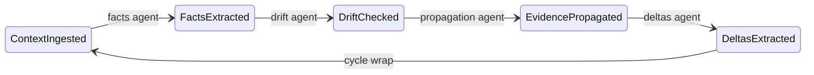

# Swarm of Governed Agents (SGRS)

## The problem

Deploying agent swarms in regulated environments (finance, pharma, insurance) hits a wall that current frameworks do not address.

**DAG-based orchestration** (LangGraph, CrewAI, Mastra, Autogen) hardcodes coordination into topology. Every new rule, exception, or agent requires rewiring the graph. Sequencing and governance are fused; you cannot change one without breaking the other. When an agent stalls, the entire downstream pipeline stalls with it.

**Prompt-chaining and role-play patterns** (ChatDev, MetaGPT) rely on LLM self-regulation. There is no formal guarantee that the system converges, no audit trail of *why* a decision was made, and no mechanism to detect that contradictory evidence has been silently absorbed.

**What regulated domains actually need:**
- A proof that the system converges (not just runs to completion)
- Per-decision audit trail binding each outcome to the exact policy version that produced it
- Bitemporal state: what was known, and when -- reconstructable for any past date
- Human-in-the-loop at the right moment, with structured context (not a bare confidence score)
- Perpetual lifecycle: finality is a checkpoint, not an endpoint. New evidence re-opens convergence.

SGRS provides all five. No existing framework does.

> **Want the full picture?** This repo is the open-access companion to a publication. It contains the working system, demo scenarios, and formal validation. For production deployment, advisory, or the extended kernel: [jeanbapt@dealexmachina.com](mailto:jeanbapt@dealexmachina.com)

---

## What SGRS is

An event-driven agent swarm where:
- **Agents are reasoning roles**, not pipeline stages. No agent knows any other agent exists.
- **Coordination emerges from shared state** (Postgres WAL + semantic graph + S3) and **declarative governance** (`governance.yaml`), not hardwired sequencing.
- A **Rust reduction kernel** (`sgrs-core`) enforces transition rules via a product lattice **M = L × A** (governance level × convergence rank), with explicit meet/join on both factors and Riesz-space stalks. Zero LLM tokens. Always available.
- **Formal convergence** is tracked via a Lyapunov disagreement function V(t), with monotonicity gates, plateau detection, and divergence escalation.
- **Ed25519-signed finality certificates** chain over time as new evidence and regulations arrive.

```
Agents --> shared bitemporal state --> governance kernel --> finality certificates
  ^                                        |
  +---- pressure-directed activation ------+
```

---

## Start here

| What you want | Where to go |
|---|---|
| Understand the terminology | [Beginner Tutorial: Lattice-State Graph](docs/tutorials/lattice-state-graph-beginner.md) |
| Run the M&A demo (5 docs, contradictions, HITL) | [Demo Guide](demo/DEMO.md) |
| Read the paper | [publications/publication_1/swarm-governed-agents.pdf](publications/publication_1/swarm-governed-agents.pdf) |
| Formal convergence theory | [docs/convergence.md](docs/convergence.md) |
| Architecture deep dive | [docs/architecture.md](docs/architecture.md) |
| Validation and test methodology | [docs/validation.md](docs/validation.md) |

---

## Quick start

**Prerequisites:** Docker, Node 20+, pnpm, OpenAI API key (or Ollama locally).

```bash
git clone https://github.com/DealExMachina/open-governed-swarm-of-agents.git
cd open-governed-swarm-of-agents

cp .env.example .env
# Edit .env: set OPENAI_API_KEY (or configure Ollama — see .env.example)

docker compose up -d
pnpm install

# First run: wait for facts-worker to install Python deps
CHECK_SERVICES_MAX_WAIT_SEC=300 pnpm run check:services

pnpm run ensure-schema          # Run all DB migrations
pnpm run ensure-bucket           # Create S3 bucket
pnpm run ensure-stream           # Create NATS stream
pnpm run seed:all                # Seed context WAL
pnpm run bootstrap-once          # Bootstrap job

pnpm run swarm                   # Start the agent hatchery
```

**Run the demo:**
```bash
pnpm run demo                    # Demo UI on http://localhost:3003
```

**Full automated E2E** (Docker, reset, migrate, seed, bootstrap, run, verify):
```bash
./scripts/run-e2e.sh
```

**Ports:** 3002 API/observability, 3003 demo UI, 3004 Grafana, 5433 Postgres, 4222 NATS, 9000 MinIO, 8010 facts-worker, 9090 Prometheus.

---

## How it works

### The cycle



Each transition is a **proposal**. No agent directly advances state. The governance kernel evaluates every proposal against policy before it takes effect.

### Three-tier governance

| Tier | What | LLM tokens | When |
|------|------|------------|------|
| **1. Rust kernel** (`sgrs-core`) | Policy check, order admissibility on M = L x A, mode routing | 0 | Always (circuit-breaker fallback) |
| **2. Oversight agent** | Accept / escalate-to-LLM / escalate-to-human | Few | When Tier 1 passes in YOLO/MITL mode |
| **3. Full LLM governance** | Reason over state, drift, rules; publish approval/rejection with rationale | Full | When Tier 2 escalates |

Circuit breaker: 3 failures, 60s cooldown, falls back to Tier 1. Every decision persisted with policy-version hash and governance path.

### Approval modes

Set in `governance.yaml` (per-scope overrides supported):

| Mode | Behavior |
|------|----------|
| `YOLO` | Valid transitions auto-approved; oversight agent may escalate. Auditable `yolo_override` on policy blocks. |
| `MITL` | Kernel escalates; proposals queued for human approval. |
| `MASTER` | Most restrictive. Policy blocks and incomparability in M = L x A produce Reject. Zero LLM tokens. |

### Convergence

Six mechanisms from the research literature:

1. **Lyapunov disagreement V(t)** -- quadratic distance to finality targets; V = 0 = perfect finality
2. **Convergence rate alpha** -- exponential decay rate with ETA estimation
3. **Monotonicity gate** -- score non-decreasing for beta=3 consecutive rounds before auto-resolve
4. **Plateau detection** -- EMA of progress ratio triggers HITL when stalled
5. **Pressure-directed activation** -- per-dimension pressure routes agents to bottleneck dimensions
6. **Elimination completeness (Gate F)** -- all certified eliminations applied before finality

| Condition | Outcome |
|-----------|---------|
| Score >= 0.92, all gates pass, trajectory quality >= 0.7 | Auto-RESOLVED |
| Convergence rate < -0.05 (diverging) | ESCALATED |
| Score in [0.40, 0.92), plateau detected | HITL review with convergence context |
| Score in [0.40, 0.92), not plateaued | ACTIVE (keep iterating) |

### Per-dimension vector finality

A scalar score permits **compensation attacks**: one dimension over-inflates to mask failures in another. SGRS enforces per-dimension vector finality by default:

- Each dimension (claim_confidence, contradiction_resolution, goal_completion, risk_score_inverse) must independently pass its threshold, monotonicity gate, and trajectory quality check.
- **contradiction_resolution has veto power** -- no amount of claim confidence or goal completion compensates for unresolved contradictions.
- Controlled via `per_dimension_finality.enabled` in `finality.yaml`.

### Perpetual finality

Finality is a **certified checkpoint**, not a terminal state:

1. Scope reaches RESOLVED -> Ed25519-signed JWS certificate issued (scores, policy hashes, timestamp).
2. Semantic graph stays live. New context (document, regulation, periodic review) re-opens convergence.
3. New cycle starts from existing graph state. Prior claims, resolutions preserved. New facts layer on top.
4. New certificate issued -> chain extends.

| Regulated domain | Re-convergence trigger | Certificate meaning |
|---|---|---|
| KYC/AML | Annual review, sanctions list update | One due diligence cycle |
| IFRS 9 (ECL) | Quarterly macro recalibration | One impairment assessment |
| Pharmacovigilance | Adverse event report | One safety reassessment |
| EUGBS Green Bond | Allocation report, taxonomy update | One compliance checkpoint |

### The bitemporal semantic graph

Postgres + pgvector. Every node/edge carries two time axes:
- **Valid time** (`valid_from`, `valid_to`): when the fact holds in the real world.
- **Transaction time** (`recorded_at`, `superseded_at`): when the system learned it.

Three audit query classes: as-of valid time, as-of transaction time, combined. Superseded nodes are never deleted. Contradiction detection respects valid-time overlap.

CRDT-inspired monotonic upserts: confidence only increases, resolution edges are irreversible, stale claims are marked irrelevant (not deleted).

---

## What this prevents

| Failure mode | How pipelines fail | How SGRS prevents it |
|---|---|---|
| **Premature closure** | Threshold on a snapshot; transient spike triggers resolution | Monotonicity gate: non-decreasing for 3 rounds |
| **Silent stagnation** | No detection; agents cycle forever | Plateau detection triggers HITL |
| **Cascade failures** | DAG edge fails, downstream fails | No edges; agents read shared state independently |
| **No audit trail** | Decisions scattered in code | Every transition logged with proposer, approver, rationale, governance path |
| **Contradictions absorbed** | New data overwrites old | CRDT upserts; contradictions are first-class edges; governance blocks on drift |
| **One-shot analysis** | Pipeline runs once | Perpetual lifecycle: finality is a checkpoint |
| **No temporal auditability** | Current-only state | Bitemporal graph: as-of queries on either time axis |
| **LLM dependency** | System halts if LLM unavailable | Three-tier governance with circuit breaker to deterministic fallback |

---

## Demo scenarios

| Scenario | Docs | Command |
|---|---|---|
| **M&A Due Diligence** (Project Horizon) | 5 docs, ARR contradiction, HITL | `pnpm run demo` |
| **Financial Consolidation** | 8 docs, restatements, dual temporality | `./scripts/run-experiment.sh financial --rounds=8` |
| **Insurance Onboarding** | 22 docs, 20+ convergence cycles | `./scripts/run-experiment.sh insurance` |
| **European Green Bond (EUGBS)** | 38 docs, full bond lifecycle | `./scripts/run-experiment.sh green-bond` |
| **Clinical Trial** | 18 docs, phase progression | `demo/scenario/docs-clinical-trial/` |
| **Solvency II** | Regulatory stress testing | `demo/scenario/docs-solvency2/` |

See [docs/demos/README.md](docs/demos/README.md) for detailed protocols.

---

## Stack

| Layer | Technology |
|---|---|
| Orchestration, agents, convergence | **TypeScript** |
| Governance kernel, finality gates, sheaf propagation | **Rust** (`sgrs-core`, napi-rs addon) |
| Fact extraction | **Python** (FastAPI + OpenAI SDK; Ollama opt-in) |
| Event bus | **NATS JetStream** |
| State store | **Postgres + pgvector** (WAL, semantic graph, convergence history) |
| Object store | **MinIO** (S3-compatible; facts, drift, history) |
| Observability | **Prometheus + Grafana + OpenTelemetry** |
| LLM | **OpenAI** or **Ollama** (extraction, rationale, HITL, embeddings) |

---

## Validation

```bash
pnpm run test                                    # 460 TypeScript tests (~50 suites)
cargo test --manifest-path sgrs-core/Cargo.toml   # 252 Rust lib tests
npx tsx scripts/benchmark-convergence.ts          # 7 convergence scenarios (no Docker)
pnpm run benchmark:sgrs                           # sgrs load benchmark
./scripts/run-e2e.sh                              # Full E2E pipeline
```

**What's proven:** Convergence dynamics (E1-E9), per-dimension vector finality (non-compensability), governance path coverage, sheaf propagation at 1024 nodes, CRDT monotonicity, deterministic replay.

**What's theoretical:** Full-system scalability beyond ~10 agents (kernel validated to 1024), long convergence over hundreds of epochs, adversarial robustness beyond 2-agent collusion.

See [docs/validation.md](docs/validation.md) for the complete methodology and known gaps.

---

## Scripts reference

| Script | Purpose |
|--------|---------|
| `pnpm run swarm` | Start agent hatchery. `swarm:start` = preflight + hatchery. |
| `pnpm run check:services` | Preflight: Postgres, S3, NATS, facts-worker. |
| `pnpm run ensure-schema` | Run all DB migrations. |
| `pnpm run ensure-bucket` | Create S3 bucket. |
| `pnpm run ensure-stream` | Create NATS stream. |
| `pnpm run bootstrap-once` | Publish bootstrap job. |
| `pnpm run seed:all` | Seed context WAL from `seed-docs/`. |
| `pnpm run seed:hitl` | Seed near-finality state with unresolved contradiction. |
| `pnpm run demo` | Demo UI (port 3003). |
| `pnpm run feed` | Feed server (port 3002). |
| `pnpm run observe` | Tail NATS events in terminal. |
| `pnpm run reset-e2e` | Truncate DB, empty S3, delete NATS stream. |
| `./scripts/run-e2e.sh` | Full automated E2E pipeline. |

---

## Configuration

**Governance rules:** `governance.yaml` -- approval mode, drift-based transition blocks.

**Finality thresholds:** `finality.yaml` -- dimension weights, convergence parameters, per-dimension finality, terminal conditions.

**Evidence schemas:** `evidence_schemas.yaml` -- required evidence types and staleness constraints per domain.

**Environment:** `.env.example` -- all runtime parameters (LLM, DB, NATS, S3, observability, model onboarding).

---

## Further reading

- [Paper (PDF)](publications/publication_1/swarm-governed-agents.pdf) -- formal design, convergence theory, six gates (A-F), perpetual finality, enterprise fitness
- [Architecture](docs/architecture.md) -- event bus, state machine, governance loop, policy engine, finality certificates
- [Convergence](docs/convergence.md) -- formal theory, Gate C, configuration reference, benchmarks
- [Experiments](docs/experiments.md) -- protocols and results
- [Validation](docs/validation.md) -- test methodology, known gaps
- [Publications index](publications/README.md)

---

## References

1. **Olfati-Saber & Murray** (2004). Consensus Problems in Networks of Agents. *IEEE TAC* 49(9). doi:[10.1109/TAC.2004.834113](https://doi.org/10.1109/TAC.2004.834113) -- Lyapunov stability for multi-agent consensus.
2. **Ruan et al.** (2025). Reaching Agreement Among Reasoning LLM Agents. arXiv:[2512.20184](https://arxiv.org/abs/2512.20184) -- Monotonicity principle for finality gate.
3. **Camacho et al.** (2024). MACI: Multi-Agent Collective Intelligence. arXiv:[2510.04488](https://arxiv.org/abs/2510.04488) -- EMA-based plateau detection.
4. **Laddad et al.** (2022). Keep CALM and CRDT On. arXiv:[2210.12605](https://arxiv.org/abs/2210.12605) (VLDB 2023) -- CRDT monotonic merges.
5. **Dorigo et al.** (2024). Swarm Intelligence: Past, Present, and Future. *Proc. Royal Society B* 291. doi:[10.1098/rspb.2024.0856](https://doi.org/10.1098/rspb.2024.0856) -- Stigmergic coordination.
6. **Snodgrass** (2000). *Developing Time-Oriented Database Applications in SQL*. Morgan Kaufmann -- Bitemporal data model.
7. **Kempe et al.** (2003). Gossip-Based Computation of Aggregate Information. *FOCS 2003*. doi:[10.1109/SFCS.2003.1238228](https://doi.org/10.1109/SFCS.2003.1238228) -- Push-sum gossip protocol.

---

## Citing this work

```bibtex
@software{governed_agent_swarm_2026,
  author       = {Jean-Baptiste D\'ezard},
  title        = {Swarm of Governed Agents: Declarative Governance, Bitemporal State,
                  and Formal Convergence for Multi-Agent Coordination},
  year         = {2026},
  url          = {https://github.com/DealExMachina/open-governed-swarm-of-agents},
  note         = {Event-driven agent swarm with Lyapunov convergence, sheaf-based
                  evidence propagation, bitemporal CRDT semantic graph, pluggable
                  policy engines, Ed25519 finality certificates, and perpetual
                  compliance lifecycle}
}
```

---

## License

**TypeScript orchestration** (root, `src/`, `scripts/`): [AGPL-3.0-only](./LICENSE).

**sgrs-core** (Rust kernel): [Elastic License 2.0](./sgrs-core/LICENSE) (ELv2).

---

> This repo is the open-access snapshot for the accompanying publication. For production deployment, extended kernel capabilities, or advisory: [jeanbapt@dealexmachina.com](mailto:jeanbapt@dealexmachina.com)
