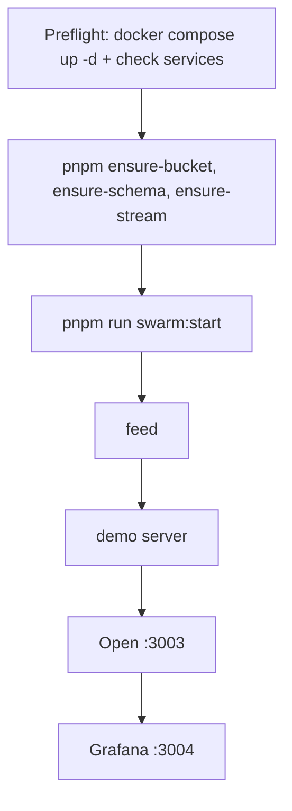
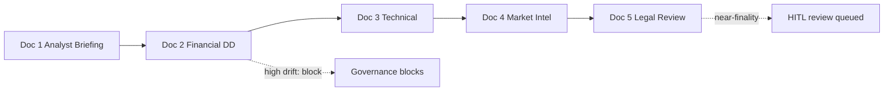

# Demo Guide

[Back to README](../../README.md). The demo reflects the **Stage 2** pipeline: 5-node state cycle (ContextIngested / FactsExtracted / DriftChecked / EvidencePropagated / DeltasExtracted), sheaf-based evidence propagation, ISS cascade monitoring, and per-dimension finality. See [stage-2-implementation-plan.md](../stage-2-implementation-plan.md) for technical details.

**Archived:** see [README.md](README.md) in this folder. Prefer [demo/DEMO.md](../../demo/DEMO.md) for the canonical walkthrough.

---

## Overview

The demo offers **four domain scenarios** (M&A, Financial, Insurance, European Green Bond). Choose one at [http://localhost:3003](http://localhost:3003).

### Scope isolation (strict)

Demo routes now run in **server-minted demo sessions** and require explicit `scope_id` on feed/MITL calls. There is no implicit fallback for demo API paths.

- Starting/changing scenario in the demo UI creates a new session and binds requests to that scope.
- Feed endpoints used by demos require `scope_id` (`/summary`, `/context/docs`, `/context/resolution`, `/pending`, `/finality-response`, `/convergence`).
- Shell walkthroughs must export `DEMO_SCOPE_ID` before posting to feed endpoints.

**Project Horizon (M&A)** is the flagship scenario: a strategic buyer evaluates the acquisition of **NovaTech AG**, a B2B SaaS company in supply chain compliance. Five documents arrive over time, each revealing new facts, contradictions, and risks. The governed swarm processes them in real time, propagates evidence along sheaf topology, enforces policy at every transition, and escalates to a human reviewer when autonomous resolution reaches its limits.

For the full walkthrough with commands and SQL queries, see [demo/DEMO.md](../../demo/DEMO.md). All four scenarios are documented in [docs/demos/](../demos/README.md).

---

## What it demonstrates

| Capability | How it appears in the demo |
|---|---|
| Structured knowledge extraction | Claims, goals, and risks extracted as typed nodes in a semantic graph |
| Contradiction detection | Doc 2 reveals a EUR 12M ARR overstatement; the system creates a contradiction edge |
| Evidence propagation | Sheaf-based diffusion of support/refutation evidence along role topology; ISS cascade stability |
| Governance intervention | High drift blocks the state transition; the cycle cannot silently proceed |
| Declarative policy | `governance-demo.yaml` rules fire without code changes |
| Per-dimension finality | Claim confidence, contradiction resolution, goal completion, risk inverse scored independently |
| Near-finality HITL review | Goal score crosses 0.75 but not 0.92; the system queues a structured human review |
| Audit trail | Every transition logged with proposer, approver, rationale, and timestamp |
| Telemetry | Grafana (port 3004) shows convergence, propagation metrics, and progress |

---

## Quick start



```bash
# 1. Preflight: starts Docker services (postgres, s3, nats, facts-worker, otel-collector, prometheus, grafana)
#    and verifies connectivity. Fixes common issues (e.g. otel-collector exited).
pnpm run demo:preflight

# 2. Migrations and streams (first-time or after reset)
pnpm run ensure-bucket && pnpm run ensure-schema && pnpm run ensure-stream

# 3. Start the swarm hatchery (all agents: facts, drift, propagation, deltas, governance) — terminal 1
export GOVERNANCE_PATH="$(pwd)/demo/scenario/governance-demo.yaml"
pnpm run swarm:start

# 4. Start the feed server (port 3002) — terminal 2
pnpm run feed

# 5. Start the demo server (port 3003) — terminal 3
pnpm run demo
```

The demo server runs a preflight check at startup. If required services are down, it exits with instructions. To bypass: `DEMO_SKIP_PREFLIGHT=1 pnpm run demo`.

Open [http://localhost:3003](http://localhost:3003) to begin the walkthrough. Grafana at [http://localhost:3004](http://localhost:3004) shows convergence, propagation, and progress once the swarm has processed documents.

**Telemetry:** Grafana requires the observability stack (`otel-collector`, `prometheus`, `grafana`). The preflight starts these if they exited. If Grafana shows no data, run `docker compose up -d otel-collector` and ensure the swarm is running. Data appears after the swarm processes at least one document.

---

## Troubleshooting

**Demo stalls on step 1 or "Could not reach feed":** Run `pnpm run demo:preflight` first. Use `pnpm run swarm:start` (not `pnpm run swarm`) so the full hatchery runs — a single facts agent cannot complete the pipeline.

**Grafana shows no data:** The telemetry pipeline requires otel-collector. If it exited, run `docker compose up -d otel-collector`. Ensure the swarm is running (metrics are emitted by the swarm process).

**Skip preflight:** `DEMO_SKIP_PREFLIGHT=1 pnpm run demo` or `RUN_DEMO_SKIP_PREFLIGHT=1 ./demo/run-demo.sh`.

---

## Explainability

The feed summary and demo expose **policy version** (governance and finality config hashes), **finality certificate** (signed JWS when RESOLVED; `GET /finality-certificate/:scope_id` on the MITL server), and **convergence** (trajectory quality, oscillation flag, ETA rounds). This supports audit and reproducibility: which policy was in effect, whether the path to finality was stable, and a verifiable certificate for resolved scopes. Bitemporal valid time on claims supports temporal contradiction rules and time-travel queries.

---

## The 5 documents



| # | Document | Key event |
|---|---|---|
| 1 | Initial Analyst Briefing | Baseline: EUR 50M ARR, 7 patents, 45% CAGR. No contradictions. Finality score low (~0.15-0.30). |
| 2 | Financial Due Diligence | ARR revised to EUR 38M. High drift detected. Governance **blocks** the transition. |
| 3 | Technical Assessment | CTO and two senior engineers departing. Risk nodes accumulate. Medium drift triggers escalation. |
| 4 | Market Intelligence | Patent infringement suit filed. Multiple unresolved contradictions. Possible ESCALATED state. |
| 5 | Legal Review | Partial resolution of contradictions. Goal score crosses near-finality threshold. HITL review queued. |

---

## Key governance moments

| Moment | Trigger | Why it matters |
|---|---|---|
| Cycle blocked after Doc 2 | High drift (ARR contradiction) hits `transition_rules` block | A EUR 12M discrepancy is not silently absorbed |
| `open_investigation` recommended | Contradiction drift at high level | Governance tells the planner to flag this formally |
| `request_external_audit` recommended | Value discrepancy drift | Internal documents alone cannot resolve the financial dispute |
| `escalate_to_risk_committee` | Risk drift at medium level (Doc 3) | Critical personnel risks require structured escalation |
| Near-finality HITL triggered | Goal score crosses 0.75 but not 0.92 (Doc 5) | The system has enough to recommend but not enough to decide -- the right moment for human judgment |
| Decision recorded | Every HITL choice stored in `scope_finality_decisions` | The decision is part of the permanent audit trail regardless of outcome |

---

## Running options

### Option A -- Demo UI (recommended)

```bash
pnpm run demo
# Open http://localhost:3003
```

Narrative walkthrough with live event stream, real-time state panel, governance highlighting, HITL modal, and speed control.

### Option B -- Shell walkthrough

```bash
./demo/run-demo.sh           # interactive, with pauses
./demo/run-demo.sh --fast    # automated, no pauses
./demo/run-demo.sh --step 3  # start at a specific step
```

### Option C -- Background seed (headless)

```bash
pnpm run seed:demo                        # 20s gap between documents
DEMO_DELAY_MS=10000 pnpm run seed:demo   # 10s gap
DEMO_DOC=02 pnpm run seed:demo            # single document
```

Monitor via the feed dashboard at [http://localhost:3002](http://localhost:3002).

---

## Full walkthrough

The complete demo with per-step expected states, curl commands, SQL queries, governance mode switching, and exploration ideas is in:

**[demo/DEMO.md](../../demo/DEMO.md)**
