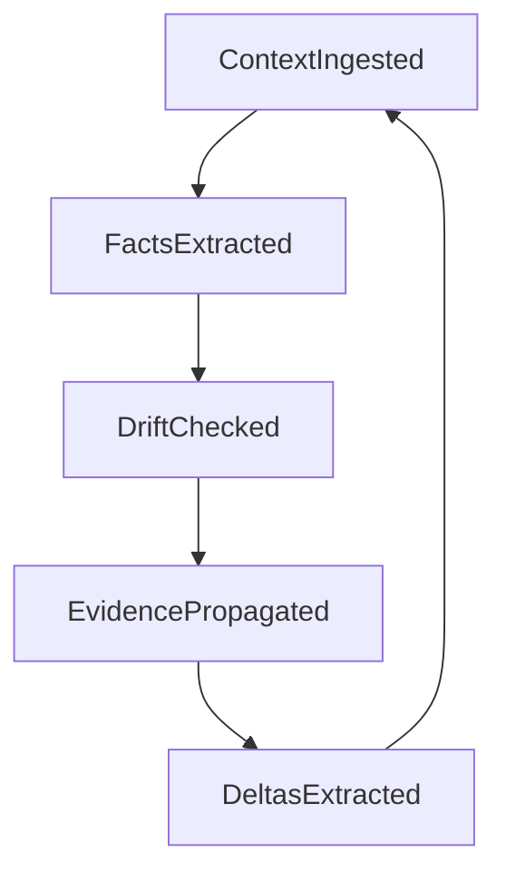
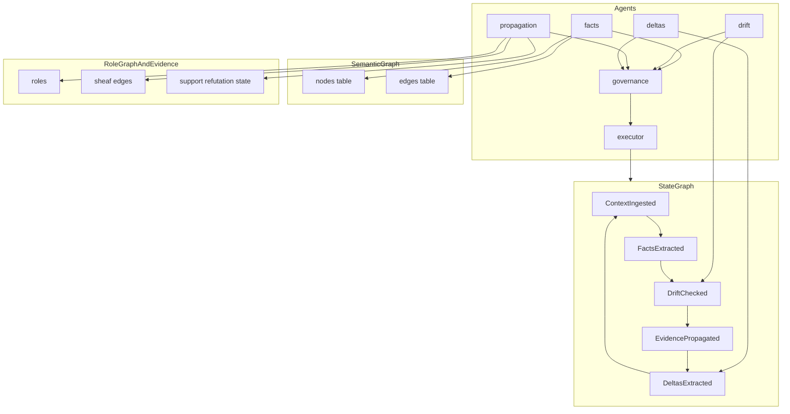

# Beginner Tutorial: Lattice-State Graph

This tutorial is for a first-time reader of the project.  
Goal: understand what the "lattice-state graph" means in practice, what the nodes/vertices are, how agents build it, and which data structures hold it.

---

## 1) First mental model: it is 4 structures, not 1

In this repository, people sometimes say "lattice-state graph" as a shortcut. In code, it is split into four connected structures:

1. **State graph**: pipeline control flow (`ContextIngested -> ... -> DeltasExtracted`)
2. **Semantic graph**: domain knowledge (claims, goals, risks, relations)
3. **Role graph**: agent-role topology for evidence propagation (sheaf edges)
4. **Lattice structures**: ordering rules for admissible governance/convergence transitions

Important: a **lattice** is an ordering/algebraic structure, not a graph of nodes and edges.

---

## 2) Nodes vs vertices: what each term means here

### A) State graph nodes (workflow phases)

Defined in `src/stateGraph.ts` as:

- `ContextIngested`
- `FactsExtracted`
- `DriftChecked`
- `EvidencePropagated`
- `DeltasExtracted`

The transition map is fixed and cyclic.

`ContextIngested` should be read broadly as "new content has entered the system":

- a document/chunk,
- a direct user input,
- a tool result or external system message.

### B) Semantic graph nodes (knowledge objects)

Stored in Postgres tables `nodes` and `edges` (see `src/semanticGraph.ts` and migrations):

- node types usually include `claim`, `goal`, `risk`, `assessment`
- edge types include relations like `contradicts`, `resolves`, `supports`

This graph represents **what is known**.

### C) Role graph vertices (propagation topology)

Configured in `propagation.yaml` under `propagation.roles` and `propagation.sheaf.edges`.

Examples of role vertices:

- `facts`, `drift`, `resolver`, `planner`, `status`, `governance`, `tuner`

Edges define who exchanges evidence with whom for diffusion.

### D) Lattice points (governance/convergence ordering)

Implemented in Rust core (`sgrs-core/src/types/mod.rs`) with product-lattice concepts such as governance level and convergence rank. This is used to decide if a transition is admissible.

---

## 3) How agents build and update these structures

Most swarm roles are declared in `src/agentRegistry.ts` (`AgentRole` + `AGENT_SPECS`). Governance and execution are separate control components in the loop.

### Core transition-producing agents

- **facts**: runs from `ContextIngested` (and can also run from `DeltasExtracted` via extended gating); extracts facts and writes semantic nodes/edges; proposes advance to `FactsExtracted`
- **drift**: compares current vs previous facts; proposes advance to `DriftChecked`
- **propagation**: propagates evidence over role graph/sheaf; proposes advance to `EvidencePropagated`
- **deltas**: extracts per-dimension changes after propagation; proposes advance to `DeltasExtracted`

### Supporting agents (no direct state advance)

- **resolver**: resolves contradictions in semantic content
- **planner**: plans actions
- **status**: summarizes state
- **tuner**: optimizes activation filters

### Governance + executor path

- Agents publish proposals.
- Governance evaluates policy and **order admissibility** on the product poset M = L × A (partial order, not joins/meets on M).
- Executor performs approved `advance_state`, which updates `swarm_state` with CAS on `epoch`.

So the state graph is not manually edited; it is advanced by agent proposals filtered through governance and executed atomically.

---

## 4) Data structures you should know first

### 4.1 State graph data (TypeScript)

In `src/stateGraph.ts`:

- `type Node = "ContextIngested" | ... | "DeltasExtracted"`
- `interface GraphState { runId; lastNode; updatedAt; epoch }`
- `transitions: Record<Node, Node>` defines allowed next step
- `advanceState(expectedEpoch, ...)` performs compare-and-swap update in `swarm_state`

`epoch` is critical: it prevents two agents from advancing the same scope at once.

### 4.2 Agent role mapping (TypeScript)

In `src/agentRegistry.ts`:

- `type AgentRole = "facts" | "drift" | ... | "tuner"`
- `interface AgentSpec` defines:
  - `requiresNode` (where role can run),
  - `targetNode` (what node it writes toward),
  - `proposesAdvance` and `advancesTo` (whether it advances the state graph).

This file is the most practical "who does what" map.

### 4.3 Semantic graph records (TypeScript + SQL)

In `src/semanticGraph.ts`:

- `interface SemanticNode` with fields like `type`, `content`, `confidence`, `status`
- `interface SemanticEdge` with `source_id`, `target_id`, `edge_type`, `weight`

These map to DB tables `nodes` and `edges`.

### 4.4 Convergence/finality state (TypeScript)

In `src/convergenceTracker.ts` and `src/finalityEvaluator.ts`:

- `ConvergencePoint`: one checkpoint in convergence history (`epoch`, `goal_score`, `lyapunov_v`, per-dimension values)
- `ConvergenceState`: trend analysis (monotonicity, plateau, oscillation, pressure)
- `FinalitySnapshot`: aggregate metrics used for finality decisions

### 4.5 Role/evidence propagation state (config + Rust core)

- Topology and channels are configured in `propagation.yaml`
- Evidence uses support/refutation channels
- Sheaf diffusion logic lives in Rust propagation modules

#### Sheaf diffusion in 60 seconds

Think of each role (`facts`, `drift`, `planner`, etc.) as a local expert with its own evidence vector.

- A role keeps a **local state** (its view of support/refutation per dimension).
- Each role is connected to neighbor roles through edges in the role graph.
- On each diffusion step, every role nudges its local state toward neighbor-compatible values.

So diffusion does not force "everyone equal." It reduces contradictions between connected roles while preserving role specialization.

In practice: repeated steps make disagreement smaller, and evidence becomes more globally consistent across the swarm.

---

## 5) End-to-end walkthrough of one cycle

1. New content is ingested (document, user input, tool message), so the scope is at `ContextIngested`.
2. `facts` agent extracts claims/goals/risks from that content, writes semantic graph content, proposes move.
3. Governance approves/rejects; if approved, executor advances to `FactsExtracted`.
4. `drift` agent analyzes changes and proposes `DriftChecked`.
5. `propagation` agent updates distributed evidence over role graph, proposes `EvidencePropagated`.
6. `deltas` agent extracts changes and proposes `DeltasExtracted`.
7. Cycle wraps to `ContextIngested` for next context batch.

At each transition, lattice/policy checks enforce admissibility and prevent invalid regressions.

---

## 6) Layered picture (how pieces connect)

---

## 7) Glossary

- **Node (state graph):** one workflow phase in the finite state cycle
- **Node (semantic graph):** one knowledge item (claim/goal/risk/assessment)
- **Vertex (role graph):** one role in propagation topology
- **Edge (semantic graph):** relation between knowledge items
- **Edge (role graph):** evidence communication channel between roles
- **Lattice:** partially ordered set with **join** and **meet** for every pair
- **Product poset M = L × A:** pairs (governance level, convergence rank) with the **product order**; used for kernel admissibility. **Not** a lattice on pairs (no general join/meet in M). **L** is a chain; **A** is componentwise partial order on ranks.
- **Stalk (sheaf):** local evidence space attached to one role vertex
- **Restriction map:** projection used to compare neighboring roles on shared edge space
- **Epoch:** CAS counter for atomic state transitions

---

## 8) Where to read next

- Implementation flow: `docs/architecture.md`
- Math foundations: `docs/math-tutorial/en/index.md`
- State machine source: `src/stateGraph.ts`
- Agent role source: `src/agentRegistry.ts`
- Semantic graph source: `src/semanticGraph.ts`
- Convergence/finality source: `src/convergenceTracker.ts`, `src/finalityEvaluator.ts`
