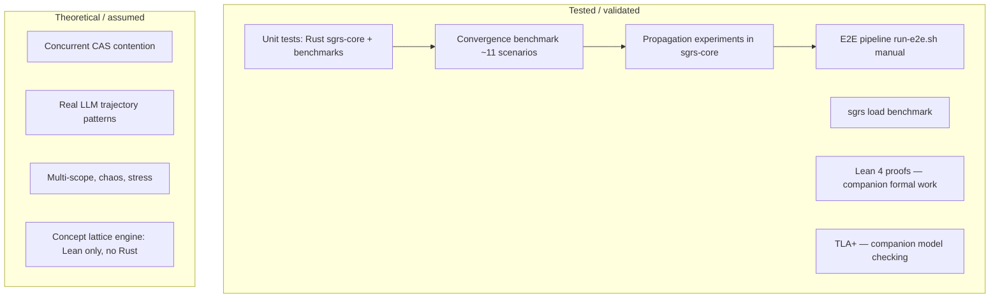

# Validation and Test Coverage

> Back to [README](../README.md) | See also [experiments.md](experiments.md) | [Codebase hygiene](codebase-hygiene.md) (missing assets, dead paths).

**Last updated:** 2026-04-30 (TS test tree absent in repo; hygiene doc; honest validation surface).

This document provides an honest accounting of what is tested, what is validated
mathematically, and what remains theoretical or unverified. The goal is
intellectual honesty: readers should understand exactly where the evidence stops
and where assumptions begin.

---

## 1. What is tested vs what is theoretical

> **Note:** Vitest is configured at the repo root, but **`test/` is not shipped** — there is currently **no executable TypeScript unit suite** in-tree. Treat “TS unit coverage” below as historical / aspirational unless you restore `test/**/*.test.ts`. See [codebase-hygiene.md](codebase-hygiene.md).

| Aspect | Tested / Validated | Theoretical / Assumed |
|--------|-------------------|-----------------------|
| State graph transitions (CAS, cycle) | Rust/kernel tests + E2E spot checks; TS unit tests unavailable until `test/` exists | Linearizability under concurrent writers (single-row CAS, no multi-node contention test) |
| Governance rules (YAML evaluation) | Intended TS tests (missing); Rust governance tests; E2E verification | That rule set is complete for production drift taxonomies |
| Governance modes (MASTER/MITL/YOLO) | Rust + E2E seed + verification script | That three modes cover all real operational needs |
| Oversight agent (LLM-backed) | No TS suite; deterministic fallbacks exercised in E2E/manual | LLM-backed oversight quality (accept/escalate decisions) |
| Convergence tracker (Lyapunov V, pressure, monotonicity, plateau, Gate C oscillation/trajectory) | `benchmark-convergence.ts` (~11 scenarios, pure math) + Rust/kernel alignment | That synthetic snapshot trajectories represent real LLM-generated fact sequences |
| sgrs kernel (governance + finality Rust addon) | `cargo test` in `sgrs-core` + load benchmark | Whole-system horizontal scaling (Node/Postgres/NATS/S3 have established profiles; composition is engineering) |
| Finality evaluator (RESOLVED, ESCALATED, review, Gate C/D, certificates) | Rust finality/gates tests; manual demo paths | That finality thresholds generalize across domains |
| Semantic graph (nodes, edges, CRDT upserts) | Integration via E2E + manual; TS unit tests absent | Graph integrity under concurrent writers from multiple agents |
| Embedding pipeline (Ollama bge-m3) | Dimension/config checks in Rust/kernel where applicable; TS tests absent | Embedding quality and semantic similarity accuracy |
| HITL finality request | Manual / demo | Human response quality and decision turnaround |
| MITL server (approve/reject/resolve) | E2E touches feed; TS pool tests absent | Operational correctness under network partitions |
| Facts agent (extract, write, Mastra) | E2E + production use; TS tests absent | Extraction accuracy across document types |
| E2E pipeline (Docker, all services) | `run-e2e.sh` script (manual, ~2 min) | Pipeline stability under sustained load |
| Policy (OpenFGA) | OpenFGA integration in compose; TS policy tests absent | OpenFGA model completeness and correctness |
| Event bus (NATS JetStream) | `sgrs-core` / integration patterns; TS mocked tests absent | Message ordering and exactly-once delivery under backpressure |
| Kernel evidence algebra (orderings, monotonicity) | proptest + deterministic Rust tests on [0,1]^4 x [0,1]^4 | Componentwise lifting to infinite rank spaces |
| Sheaf diffusion (L_F, contraction, spectral gap) | 12 propagation experiments E1-E12 across 5 topologies | Identity restriction maps only (constant sheaf); non-trivial sheaf untested |
| ISS cascade stability | E7: adversarial kappa ~ 0.19, parametric sweep confirms boundary kappa* = 0.5775 | LLM perturbation bound assumed, not enforced |
| Gossip protocols (average, Tarski, push-sum) | E10-E12: 1024-node stress test; impossibility theorem confirmed (24/24 configs) | Bilateral exchange assumption (push-sum equivalence) |
| Π_A projection closure (kernel-admissible set) | 6 proptests (monotonicity, fixed-point on A, non-extensive) + `Projected<T>` newtype | Box clamp sufficient for all admissible sets |
| Product lattice **M = L × A** (kernel admissibility + meet/join) | Rust governance + types tests; `meet/join` on `GovernanceLevel`, `ConvergenceRank`, `LatticePoint`; norm/monotonicity properties via `gap_norm_squared`, `lyapunov_order_property`, `pressure_equals_gap_weights` | Distributive lattice; norm-monotone V on the rank factor |
| Causal DAG (Rust) | Property-based + unit tests in `sgrs-core` (`cargo test`) | That DAG frontier determines concept lattice (Conj. 10.2) |
| Causal contributions (TS) | `emitContribution` from facts, drift, propagation, governance, resolver, status; `finalityEvaluator` on RESOLVED | Runtime Contribution → EvidenceState mapping intentionally not implemented **by architecture lock** (audit-only DAG) |
| WAL vs causal DAG | Governance and other paths call `appendEvent` for semantic WAL; `createContribution` does not auto-append WAL | Feed/state consumers must not assume a contribution row implies a matching WAL event |
| Model onboarding (P0) | `enforceModelOnboarding` in `modelConfig.ts`; no dedicated TS tests in repo | With `MODEL_ONBOARDING_ENFORCE` off or missing policy, any model is accepted (documented fallback) |
| Lean 4 proofs | 138 items (46 theorems + 41 defs + 4 structures) across 9 files, type-checked | Proofs use Fin n -> Prop (not computable Finset); Rust must match structurally |
| TLA+ model checking | KernelBilattice.tla: 4 safety invariants, 10,160 states, 0 violations | Covers two configurations; not exhaustive over all parameters |

---

## 2. TypeScript unit tests (Vitest)

**Status:** `vitest.config.ts` expects files under `test/**/*.test.ts` and `test/setup.ts`. **This repository snapshot does not include a `test/` directory**, so `pnpm run test` exits with *no test files*. The table below is **retained as a checklist** of modules that were historically covered by Vitest-style tests; restore files if you reintroduce the suite.

| Module / concern | What to cover when adding tests |
|-----------------|----------------------------------|
| WAL, logger, S3 helpers, events, event bus | IO boundaries, ack/drain behaviour |
| Governance YAML, state graph CAS, convergence tracker | Policy evaluation, epoch races, Lyapunov helpers |
| Finality evaluator, certificates, MITL, policy versions | RESOLVED/ESCALATED/review paths, JWS round-trip |
| Semantic graph + embeddings | CRDT monotonicity, embedding dimensions |
| Agents (facts, drift, planner, status, governance) | Pipeline contracts with mocked storage |
| Telemetry / metrics | No-throw instrumentation |

**Rust:** Primary automated coverage for the kernel remains `cargo test --manifest-path sgrs-core/Cargo.toml` (library + integration crates under `sgrs-core/tests/`).

See [codebase-hygiene.md](codebase-hygiene.md).

---

## 3. Convergence benchmark (11 scenarios)

**Pure math. No Docker, no Postgres, no NATS, no LLM.**

Run: `pnpm tsx scripts/benchmark-convergence.ts`

The benchmark generates synthetic `FinalitySnapshot` sequences, pipes them through
`computeLyapunovV`, `computePressure`, `computeDimensionScores`, and
`analyzeConvergence`, then checks outcomes against expectations. Four additional
lattice-algebra scenarios (A–D) verify the order and norm-monotonicity structure
added in the v2 retrofit.

| Scenario | Rounds | What it tests | Expected outcome |
|----------|--------|--------------|------------------|
| Steady convergence | 15 | All dimensions improve ~5%/round | Converging, monotonic, no plateau, V near 0 |
| Plateau at 0.70 | 10 | Score oscillates around 0.70 with tiny jitter | Plateau detected, not converging, not monotonic |
| Spike-and-drop | 5 | Score spikes to 0.95 then drops to 0.70 | Monotonicity gate broken despite positive avg rate |
| Divergence | 6 | Contradictions increase each round, confidence drops | Diverging (rate < 0), plateau flagged (stalled), no ETA |
| One-dimension bottleneck | 5 | 3 dims at target, contradiction_resolution stuck at 25% | Plateau, highest pressure = contradiction_resolution |
| Fast convergence | 3 | Reaches 0.92+ in 3 rounds | Converging, monotonic, no false plateau |
| Empty graph | 1 | No claims, no goals, zero snapshot | Safe defaults, no crash, no convergence |
| **A: Governance escalation** | 3 | V1 > V2 > V3 across Yolo→Mitl→Master stages | V non-increasing; governance order and convergence order aligned |
| **B: Conservative merger** | — | meet(A,B) vs join(A,B) for incomparable agents | V(meet) ≥ V(join); meet is the safe kernel decision |
| **C: Contradiction resolution** | 2 | Pre→post resolution: 3/4 contradictions resolved | V decreases; contradiction_resolution pressure drops |
| **D: Anti-compensation** | — | Veto dim (contradiction_resolution) stuck at 0.50 | V non-zero; improving non-veto dims does not reduce V |

All 11 scenarios must pass for the benchmark to exit 0. The benchmark validates
the mathematical properties of the convergence tracker (Lyapunov stability
theory applied to finality scoring) but does **not** validate that real LLM
output produces trajectories that match these synthetic patterns.

---

## 4. sgrs load benchmark

**Pure sgrs (Rust kernel). No Docker, no Postgres, no NATS.**

Run: `pnpm run benchmark:sgrs` or `npx tsx scripts/benchmark-sgrs-load.ts`

Multiple concurrent workers share a single governance config (e.g. `governance.yaml`). Each worker repeatedly calls sgrs: kernel, transition, rules, gates, convergence. The benchmark reports total ops, elapsed time, throughput (ops/s), per-operation latency (p50/p95/p99), and verifies that **all instances produce identical outputs for the same inputs** (unified governance).

| Option | Default | Meaning |
|--------|---------|---------|
| `--instances=N` | 4 | Concurrent workers |
| `--duration=N` | 5 | Seconds to run |
| `--ops=N` | — | Total ops then stop (overrides duration) |
| `--mix=M` | both | governance \| finality \| both |

This validates that the governance/convergence kernel is not a throughput bottleneck and that policy evaluation is deterministic across instances. Whole-system scalability (Node, Postgres, NATS, S3) is an engineering/composition concern; those components have established scalability evaluations elsewhere.

---

## 5. E2E pipeline

**Script:** `scripts/run-e2e.sh`
**Duration:** ~2 minutes (excluding Docker image build on first run; facts-worker
pip install can add 3-5 minutes on cold start).
**Requires:** Docker, `psql` on PATH, `.env` with either `OPENAI_API_KEY` or
host Ollama running.

### Steps

| Step | What it does | What it proves |
|------|-------------|----------------|
| 1 | `docker compose up -d postgres s3 nats facts-worker feed` | Infrastructure starts |
| 2 | Wait for Postgres (`pg_isready`), then `check-services.ts` (Postgres, S3, NATS, facts-worker, feed; up to 300s) | All services reachable before proceeding |
| 2b | `reset-e2e.ts` | Clean slate (DB tables, S3 objects, NATS streams) |
| 3 | Run migrations 002, 003, 005, 006 via `psql` | Schema is correct and migrations are idempotent |
| 4 | `ensure-bucket.ts` + `ensure-stream.ts` | S3 bucket and NATS stream exist |
| 5 | `seed-all.ts` + `bootstrap-once.ts` | Seed documents ingested, state initialized |
| 5b | `ensure-pull-consumers.ts` | Durable pull consumers (fixes push consumer errors) |
| 5c | `seed-governance-e2e.ts` | State set to DriftChecked/epoch 5, drift=high, 3 proposals published |
| 6 | Start 6 processes (facts, drift, planner, status, governance, executor) | All agents start and consume jobs without crashing |
| 7 | `curl /summary` | Feed server responds, context is populated |
| 8 | POST a document to `/context/docs` | Document ingestion triggers facts pipeline |
| 9 | Wait 40s, `curl /summary` again | Facts extracted and written (S3 + semantic graph) |
| 10 | Query `nodes` table (GROUP BY type) | Semantic graph populated with claim/goal/risk nodes |
| 11 | Query `edges` table (GROUP BY edge_type) | Contradiction/resolves edges created |
| 12 | `verify-governance-paths.ts` | Governance audit trail verified (see section 6) |

The E2E script is **not automated in CI**. It requires Docker and either an
OpenAI key or a running Ollama instance. It is run manually before releases.

---

## 6. Governance path auditing

### Seed: `seed-governance-e2e.ts`

Sets up a deterministic scenario:
- **State:** DriftChecked, epoch 5, runId "seed-governance-e2e"
- **Drift:** high (written to S3 as `drift/latest.json`)
- **Proposals:** Three proposals for the same transition (DriftChecked -> ContextIngested, epoch 5), each with a different mode

### Verify: `verify-governance-paths.ts`

Queries `context_events` for governance decision records and checks:

| Mode | Expected outcome | Verification |
|------|-----------------|--------------|
| **MASTER** | Approved with `governance_path: "processProposal"`, `reason: "policy_passed"` | At least one `proposal_approved` event matches |
| **MITL** | Pending with `governance_path: "processProposal"` | At least one `proposal_pending_approval` event matches (warning if absent due to timing) |
| **YOLO** | Rejected with reason containing "drift" | At least one `proposal_rejected` event matches (path may be `processProposal` or `oversight_acceptDeterministic` depending on LLM availability) |

The verifier exits 0 only if MASTER-approved and YOLO-rejected are both found.
MITL-pending is checked but produces a warning rather than a hard failure (timing
sensitivity with NATS consumption order).

### Audit trail

Every proposal decision written to the context WAL includes a `governance_path`
field. Possible values: `processProposal`, `oversight_acceptDeterministic`,
`oversight_escalateToLLM`, `oversight_escalateToHuman`,
`processProposalWithAgent`. This allows post-hoc auditing of which code path
produced each decision.

---

## 7. HITL finality scenario

### Seed: `seed-hitl-scenario.ts`

Populates the semantic graph with a deterministic state designed to land the
goal score in the near-finality band (between `NEAR_FINALITY_THRESHOLD` and
`AUTO_FINALITY_THRESHOLD`), preventing auto-resolution.

**What it creates (scope: default):**
- 5 claim nodes (confidence 0.9, active)
- 5 goal nodes (4 resolved, 1 active -- so goals_completion_ratio = 4/5 = 0.80)
- 2 risk nodes (high severity, active)
- 2 contradiction edges (claims[0] vs claims[2], claims[1] vs claims[4])
- 1 resolves edge (resolving the first contradiction only)

**Net state:** One unresolved contradiction remains. Goal score falls in the
review band because contradiction_resolution < 1 and goals_completion_ratio < 1.

### What triggers

When the swarm runs and governance calls `runFinalityCheck(scopeId)`:

1. `evaluateFinality` loads the snapshot from the semantic graph
2. Goal score is computed and falls in [near, auto) range
3. `evaluateFinality` returns `{ kind: "review", request: { ... } }`
4. `submitFinalityReviewForScope` creates a MITL pending entry with the finality review
5. The feed server shows near_finality with dimension breakdown, blockers, and suggested actions

### Expected output

- MITL pending queue contains a `finality_review` proposal from `finality-evaluator`
- The review payload includes: `goal_score`, `dimension_breakdown` (claim_confidence, contradiction_resolution, goal_completion, risk_score_inverse), `blockers` (unresolved contradiction), and `options` (approve_finality, reject_finality, defer, request_more_info)
- A human operator can respond via the MITL API (`POST /mitl/:id/finality-response`)

---

## 8. Known validation gaps

This section is intentionally candid. The following areas have **no automated
validation** and represent known gaps:

1. **No stress testing.** There are no tests for behavior under high message
   throughput, large semantic graphs (10k+ nodes), or sustained concurrent
   agent activity. The CAS mechanism in `advanceState` is tested for single
   conflicts but not for contention from multiple agents racing.

2. **No chaos testing.** There are no tests for service failures (Postgres
   restart, NATS partition, S3 unavailability) during pipeline execution.
   The system is designed for graceful degradation (e.g., embedding failures
   are logged and skipped) but this has not been validated systematically.

3. **No multi-scope E2E.** All E2E testing uses `scope_id = "default"`. The
   governance system supports per-scope mode overrides (e.g., `financial_dd: MITL`)
   and the semantic graph is scoped, but no E2E test exercises multiple scopes
   simultaneously.

4. **Convergence validated with math first, not representative LLM traces.** The convergence
   tracker is validated against synthetic snapshot trajectories (`benchmark-convergence.ts` and Rust tests). The assumption that real LLM-extracted facts produce trajectories resembling these patterns is unvalidated.

5. **Demo and TypeScript tests not in CI.** The E2E script (`run-e2e.sh`) requires Docker plus an LLM backend and is not wired into CI. **`pnpm run test` finds no files** until `test/**/*.test.ts` exists. Primary automated coverage is **Rust** (`sgrs-core`).

6. **LLM oversight quality unvalidated.** When an LLM is configured, the
   oversight agent chooses between accepting the deterministic result,
   escalating to a full LLM evaluation, or escalating to a human. The quality
   of this triage decision has not been evaluated (no accuracy benchmarks, no
   confusion matrix, no A/B testing).

7. **Embedding semantic accuracy largely unmeasured in this repo.** The embedding pipeline is tested
   for dimensional correctness where covered in Rust/kernel work, but not for
   semantic quality. Whether bge-m3 embeddings produce meaningful similarity
   scores for the types of claims, goals, and risks in this system is assumed,
   not measured.

8. **HITL decision quality unmeasured.** The HITL flow is mechanically tested
   (seed scenario triggers review, pending entry created with correct shape)
   but the quality of human decisions and their downstream effects on finality
   convergence are not tracked or measured.

9. **No integration tests for NATS message ordering.** There are no in-repo Vitest suites that mock or exercise JetStream ordering. JetStream delivery guarantees (at-least-once, consumer
   ack) are trusted but not verified by a dedicated integration test in this snapshot.

10. **Migration rollback untested.** Migrations are applied forward only. There
    are no down migrations and no tests for schema rollback.

---

## 9. Propagation experiment summary (historical snapshot)

Propagation-focused experiments validated sheaf diffusion, kernel evidence algebra, topology sensitivity, gossip protocols, and the impossibility theorem in prior internal runs.

| ID | Key Result | Run Date |
|----|------------|----------|
| E1 | Error amplification ratio = 0.000 (3 seeds) | 2026-03-09 |
| E2 | Contradiction detection at step 0 (21 pairs) | 2026-03-09 |
| E3 | Max revisions = 1 for perturbations 0.1-0.4 | 2026-03-09 |
| E4-T | 570/570 converged across 5 topologies; Pareto cost analysis | 2026-03-10 |
| E5-T | Pearson r = 0.9940 (tau ~ 1/lambda_1) across 5 topology families (30 runs) | 2026-03-10 |
| E6 | Mean support ~ 0.56 +/- 0.02 on both orthogonal dims | 2026-03-09 |
| E7 | Adversarial kappa ~ 0.19, SG = 0.34 < 1; boundary kappa* = 0.5775 | 2026-03-09 |
| E8-T | Hybrid <= standard on all topologies; Tarski in 2 steps | 2026-03-10 |
| E9 | Tarski 88x cheaper on chain(20); linear 437x cheaper on complete(20) | 2026-03-10 |
| E10 | Gossip-Tarski converges to wrong fixed point (global MAX, not mean) | 2026-03-10 |
| E11 | Gossip-average correct at n=1024 (0.32% residual, 34ms) | 2026-03-14 |
| E12 | Impossibility: 100% <=_k violation for correct protocols (24/24 configs) | 2026-03-14 |

### 9.1 Follow-on checks (E19, E20)

Two Phase-2 follow-on checks were added to close the Extract/escalation gap:

- **E19 (Extract boundary loss):** `2/1000` disagreement (`0.20%`) between
  vector-aware and scalarized finality on a controlled random corpus; below
  the `5%` alert threshold.
- **E20 (escalation necessity):** pressure-directed governance converges faster
  than always-MASTER in the controlled M&A proxy (`7.27` vs `7.71` mean steps)
  while cutting escalation load (`4.01` vs `7.71`) and removing unnecessary
  escalations in this profile.

See [docs/experiments/e19-e20/README.md](experiments/e19-e20/README.md) and
artifacts under `artifacts/experiments/e19` and `artifacts/experiments/e20`.

### 9.2 Snapshot scope note

This open snapshot intentionally excludes advanced concept-lattice experiment files and
their derived artifacts. The validation set retained here focuses on baseline
swarm runtime, governance/finality behavior, and publication_1-aligned
experiments.

## 10. Stage 1 experiments (exp1--exp9) and domain demos

Stage 1 experiments require Docker and test the full agent pipeline. Defined protocols, gitignored results.

| Experiment | Goal | Issue |
|------------|------|-------|
| 1. Convergence dynamics | Multi-iteration V(t) trajectories, varying contradiction density | [#12](https://github.com/DealExMachina/open-governed-swarm-of-agents/issues/12) |
| 2. Scalability | Vary claims, contradictions, agents; measure rounds, tokens, audit events | [#13](https://github.com/DealExMachina/open-governed-swarm-of-agents/issues/13) |
| 3. Finality robustness | Adversarial evidence (spike-and-drop, oscillation, stale) | [#14](https://github.com/DealExMachina/open-governed-swarm-of-agents/issues/14) |
| 4. Multi-level governance | L1/L2/L3 escalation, decision distribution | [#15](https://github.com/DealExMachina/open-governed-swarm-of-agents/issues/15) |
| 5. Coverage-autonomy trade-off | YOLO vs MITL vs MASTER on identical document set | [#16](https://github.com/DealExMachina/open-governed-swarm-of-agents/issues/16) (closed) |
| 6. Monotonic progress + discretization | Assumptions #3, #1; full pipeline + resolver | [#20](https://github.com/DealExMachina/open-governed-swarm-of-agents/issues/20) |
| 7. Tier 2/3 governance, Tier-3 reachability | Assumption #4; tier coverage | [#21](https://github.com/DealExMachina/open-governed-swarm-of-agents/issues/21) |
| 8. Cooperative agent model | Assumption #5; adversarial defense | [#22](https://github.com/DealExMachina/open-governed-swarm-of-agents/issues/22) |
| 9. Local confluence | Assumption #2; CRDT + eventual consistency | [#23](https://github.com/DealExMachina/open-governed-swarm-of-agents/issues/23) |

**Domain demos:** 4 scenarios validated (M&A Project Horizon, Financial consolidation, Insurance onboarding, European Green Bond).

## 11. Formal verification

| Tool | Scope | Items | Status |
|------|-------|-------|--------|
| Lean 4 | Bilattice algebra (Basic.lean) | 28 items | Type-checked, no Mathlib |
| Lean 4 | Hybrid pipeline (HybridPipeline.lean) | 17 items | Type-checked, Gate F proven |
| TLA+ | KernelBilattice state machine | 4 safety invariants | 10,160 states, 0 violations |

**Open proof obligations:** PO-3.5b (Markov rate bound, needs Mathlib R), PO-3.9 (spectral gap characterization).  
PO-3.7e and PO-3.8 are tracked as follow-up proof obligations.

See [experiments.md](experiments.md) for full protocol details. When `per_dimension_finality.enabled` is true in `finality.yaml`, experiments run under **per-dimension (vector) finality**.
